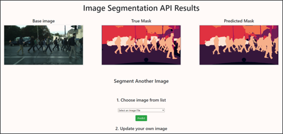
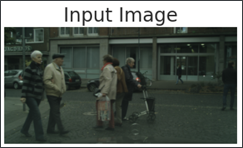
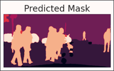
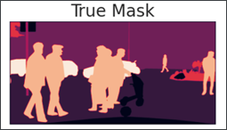
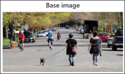
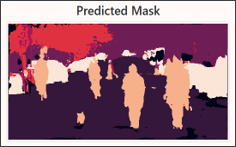

# Designing an Image Segmentation Model

An Image Segmentation Model designed to be used within the Computer Vision System 
of a Self Driving Vehicle.

It is trained based on the [Cityscrapes Dataset](https://www.cityscapes-dataset.com/).

This model identifies different classes of objects in photos captured by a Vehicle's sensors :

- Constructions
- Nature
- Sky
- People
- Vehicle
- Object

Due to limited computing power at my disposal, the model is not able to differentiate between 
different types of objects within the same class (example : it does not differentiate a truck
from a car).

The prediction API is then published on a web interface using Flask.

## Useful Links

* [Project presentation (Powerpoint)](Project_Presentation.pptx)
* [Technical Report of Model development (Word)](Technical_Report.docx)
* [Jupyter Notebook (Model training)](Notebook.ipynb)
* [Flask Deployment Folder](Deployment/)

## Screenshots

### Web Interface

### Model Prediction

### Predicts stock images

## Libraries / Packages Used

* [Tensorflow - Keras](https://www.tensorflow.org/)
* [Flask](https://flask.palletsprojects.com/en/2.2.x/)
* [Scikit-Image](https://scikit-image.org/)
* [Albumentations](https://albumentations.ai/)
* [Open CV](https://opencv.org/)
* [Segmentation Models](https://github.com/qubvel/segmentation_models)
* [SqueezeNet Keras Implementation](https://github.com/rcmalli/keras-squeezenet)
* [Bootstrap](https://getbootstrap.com/)
* Matplotlib / Seaborn
* Pandas / Numpy 

## Developed By

Octave Antoni

[Connect with me on Linkedin](https://www.linkedin.com/in/octave-antoni/)

## License

    Copyright 2023 Octave Antoni

    Licensed under the Apache License, Version 2.0 (the "License");
    you may not use this file except in compliance with the License.
    You may obtain a copy of the License at

        http://www.apache.org/licenses/LICENSE-2.0

    Unless required by applicable law or agreed to in writing, software
    distributed under the License is distributed on an "AS IS" BASIS,
    WITHOUT WARRANTIES OR CONDITIONS OF ANY KIND, either express or implied.
    See the License for the specific language governing permissions and
    limitations under the License.